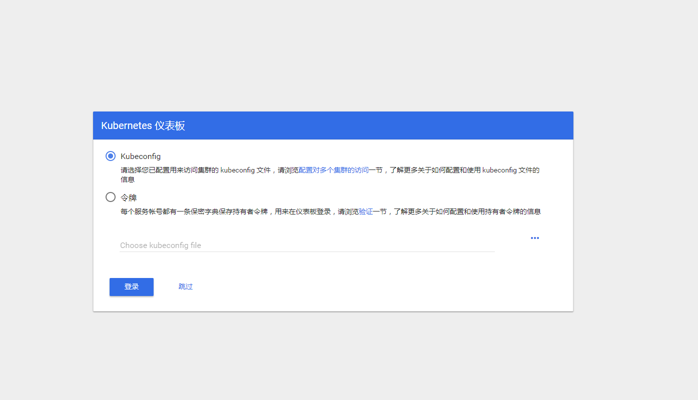
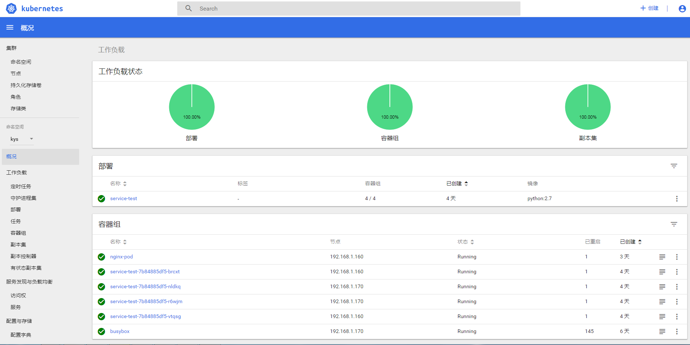

# 安装dashboard 插件

## 1.1 切换到 kubernetes 源码目录

``` bash
  cd /opt/kubernetes/cluster/addons/dashboard

```

## 1.2 修改几个地方

``` bash
  $ cat dashboard-service.yaml
  apiVersion: v1
  kind: Service
  metadata:
    name: kubernetes-dashboard
    namespace: kube-system
    labels:
      k8s-app: kubernetes-dashboard
      kubernetes.io/cluster-service: "true"
      addonmanager.kubernetes.io/mode: Reconcile
  spec:
    type: NodePort # 增加这一行
    selector:
      k8s-app: kubernetes-dashboard
    ports:
    - port: 443
      targetPort: 8443
```

修改镜像地址

``` bash
apiVersion: apps/v1
kind: Deployment
metadata:
  name: kubernetes-dashboard
  namespace: kube-system
  labels:
    k8s-app: kubernetes-dashboard
    kubernetes.io/cluster-service: "true"
    addonmanager.kubernetes.io/mode: Reconcile
spec:
  selector:
    matchLabels:
      k8s-app: kubernetes-dashboard
  template:
    metadata:
      labels:
        k8s-app: kubernetes-dashboard
      annotations:
        scheduler.alpha.kubernetes.io/critical-pod: ''
        seccomp.security.alpha.kubernetes.io/pod: 'docker/default'
    spec:
      priorityClassName: system-cluster-critical
      containers:
      - name: kubernetes-dashboard
        image: registry.cn-hangzhou.aliyuncs.com/kuberneters/kubernetes-dashboard-amd64:v1.8.3  ##原来是k8s.gcr.io 这个镜像，服务器在国外，#下载不了
        resources:
          limits:
            cpu: 100m
            memory: 300Mi
          requests:
            cpu: 50m
            memory: 100Mi
        ports:
        - containerPort: 8443
          protocol: TCP
        args:
          # PLATFORM-SPECIFIC ARGS HERE
          - --auto-generate-certificates
        volumeMounts:
        - name: kubernetes-dashboard-certs
          mountPath: /certs
        - name: tmp-volume
          mountPath: /tmp
        livenessProbe:
          httpGet:
            scheme: HTTPS
            path: /
            port: 8443
          initialDelaySeconds: 30
          timeoutSeconds: 30
      volumes:
      - name: kubernetes-dashboard-certs
        secret:
          secretName: kubernetes-dashboard-certs
      - name: tmp-volume
        emptyDir: {}
      serviceAccountName: kubernetes-dashboard
      tolerations:
      - key: "CriticalAddonsOnly"
        operator: "Exists"
  
```

## 执行创建语句

``` bash
kubectl apply -f .
```

## 查看分配的 NodePort

``` bash
  $ kubectl get deployment kubernetes-dashboard  -n kube-system
  NAME                   DESIRED   CURRENT   UP-TO-DATE   AVAILABLE   AGE
  kubernetes-dashboard   1         1         1            1           2m

  $ kubectl --namespace kube-system get pods -o wide
  NAME                                    READY     STATUS    RESTARTS   AGE       IP             NODE              NOMINATED NODE
  coredns-77cd44d8df-4fmfc                1/1       Running   0          1h        172.30.200.2   m7-autocv-gpu03   <none>
  kubernetes-dashboard-69db8c7745-jtvpj   1/1       Running   0          55s       172.30.112.3   m7-autocv-gpu01   <none>

  $ kubectl get services kubernetes-dashboard -n kube-system
  NAME                   TYPE       CLUSTER-IP     EXTERNAL-IP   PORT(S)         AGE
  kubernetes-dashboard   NodePort   10.254.9.198   <none>        443:32014/TCP   1m
```

## 查看 dashboard 支持的命令行参数

``` bash
  $ kubectl exec --namespace kube-system -it kubernetes-dashboard-69db8c7745-jtvpj  -- /dashboard --help # kubernetes-dashboard-69db8c7745-jtvpj 为 pod 名称
  2018/08/15 13:12:03 Starting overwatch
  Usage of /dashboard:
        --alsologtostderr                   log to standard error as well as files
        --apiserver-host string             The address of the Kubernetes Apiserver to connect to in the format of protocol://address:port, e.g., http://localhost:8080. If not specified, the assumption is that the binary runs inside a Kubernetes cluster and local discovery is attempted.
        --authentication-mode stringSlice   Enables authentication options that will be reflected on login screen. Supported values: token, basic. Default: token.Note that basic option should only be used if apiserver has '--authorization-mode=ABAC' and '--basic-auth-file' flags set. (default [token])
        --auto-generate-certificates        When set to true, Dashboard will automatically generate certificates used to serve HTTPS. Default: false.
        --bind-address ip                   The IP address on which to serve the --secure-port (set to 0.0.0.0 for all interfaces). (default 0.0.0.0)
        --default-cert-dir string           Directory path containing '--tls-cert-file' and '--tls-key-file' files. Used also when auto-generating certificates flag is set. (default "/certs")
        --disable-settings-authorizer       When enabled, Dashboard settings page will not require user to be logged in and authorized to access settings page.
        --enable-insecure-login             When enabled, Dashboard login view will also be shown when Dashboard is not served over HTTPS. Default: false.
        --heapster-host string              The address of the Heapster Apiserver to connect to in the format of protocol://address:port, e.g., http://localhost:8082. If not specified, the assumption is that the binary runs inside a Kubernetes cluster and service proxy will be used.
        --insecure-bind-address ip          The IP address on which to serve the --port (set to 0.0.0.0 for all interfaces). (default 127.0.0.1)
        --insecure-port int                 The port to listen to for incoming HTTP requests. (default 9090)
        --kubeconfig string                 Path to kubeconfig file with authorization and master location information.
        --log_backtrace_at traceLocation    when logging hits line file:N, emit a stack trace (default :0)
        --log_dir string                    If non-empty, write log files in this directory
        --logtostderr                       log to standard error instead of files
        --metric-client-check-period int    Time in seconds that defines how often configured metric client health check should be run. Default: 30 seconds. (default 30)
        --port int                          The secure port to listen to for incoming HTTPS requests. (default 8443)
        --stderrthreshold severity          logs at or above this threshold go to stderr (default 2)
        --system-banner string              When non-empty displays message to Dashboard users. Accepts simple HTML tags. Default: ''.
        --system-banner-severity string     Severity of system banner. Should be one of 'INFO|WARNING|ERROR'. Default: 'INFO'. (default "INFO")
        --tls-cert-file string              File containing the default x509 Certificate for HTTPS.
        --tls-key-file string               File containing the default x509 private key matching --tls-cert-file.
        --token-ttl int                     Expiration time (in seconds) of JWE tokens generated by dashboard. Default: 15 min. 0 - never expires (default 900)
    -v, --v Level                           log level for V logs
        --vmodule moduleSpec                comma-separated list of pattern=N settings for file-filtered logging
  command terminated with exit code 2
```

## 访问dashboard 

kubernetes-dashboard 服务暴露了 NodePort，可以使用 https://NodeIP:NodePort 地址访问 dashboard；
通过 kube-apiserver 访问 dashboard；
通过 kubectl proxy 访问 dashboard：

``` bash
  [root@k8s-master dashboard]# kubectl cluster-info
  
  Kubernetes master is running at http://localhost:8080
  CoreDNS is running at http://localhost:8080/api/v1/namespaces/kube-system/services/kube-dns:dns/proxy
  kubernetes-dashboard is running at http://localhost:8080/api/v1/namespaces/kube-system/services/https:kubernetes-dashboard:/proxy

  To further debug and diagnose cluster problems, use 'kubectl cluster-info dump'.

  通过api 访问 https://192.168.1.150:6443/api/v1/namespaces/kube-system/services/https:kubernetes-dashboard:/proxy
  跳转到----> https://192.168.1.150:6443/api/v1/namespaces/kube-system/services/https:kubernetes-dashboard:/proxy/#!/login
```


## dashboard 主界面



## 生成登录的token

``` bash
kubectl create sa dashboard-admin -n kube-system
kubectl create clusterrolebinding dashboard-admin --clusterrole=cluster-admin --serviceaccount=kube-system:dashboard-admin
ADMIN_SECRET=$(kubectl get secrets -n kube-system | grep dashboard-admin | awk '{print $1}')
DASHBOARD_LOGIN_TOKEN=$(kubectl describe secret -n kube-system ${ADMIN_SECRET} | grep -E '^token' | awk '{print $2}')
echo ${DASHBOARD_LOGIN_TOKEN}

eyJhbGciOiJSUzI1NiIsImtpZCI6IiJ9.eyJpc3MiOiJrdWJlcm5ldGVzL3NlcnZpY2VhY2NvdW50Iiwia3ViZXJuZXRlcy5pby9zZXJ2aWNlYWNjb3VudC9uYW1lc3BhY2UiOiJrdWJlLXN5c3RlbSIsImt1YmVybmV0ZXMuaW8vc2VydmljZWFjY291bnQvc2VjcmV0Lm5hbWUiOiJkYXNoYm9hcmQtYWRtaW4tdG9rZW4tMmh0Y3oiLCJrdWJlcm5ldGVzLmlvL3NlcnZpY2VhY2NvdW50L3NlcnZpY2UtYWNjb3VudC5uYW1lIjoiZGFzaGJvYXJkLWFkbWluIiwia3ViZXJuZXRlcy5pby9zZXJ2aWNlYWNjb3VudC9zZXJ2aWNlLWFjY291bnQudWlkIjoiOTg3ZTQyZjYtNDk1Ny0xMWU5LTlhNDUtMGM5ZDkyYzkwZjRmIiwic3ViIjoic3lzdGVtOnNlcnZpY2VhY2NvdW50Omt1YmUtc3lzdGVtOmRhc2hib2FyZC1hZG1pbiJ9.l5A5h6O34yoIaPrtV9eoddfVg0TUanYCDXQf1SWs0ccEyQSnQnjZGhrRnG-O2o7XabVGt3jondHOEgT-OBlSlkR0dcQN5eJ8OC1sGmGbfxfrJtExWcNDf0RppHGqi8YyX0zMK1xZ7bcsQOMhWkhCXTefBYsD1RfgE0Lb8CsRm_QSHkH8YWYckQ3CAUNx3-EYa-BGv8bGXfKzqQ237gSxo6DdbSupEwX8oXyeggK_Ub6wMhs8Q6Dkt1xgdKri7pmSpjYRR446oFiAfILU7xqeUnLXM8c1b34hc2TIQLguZYx6pr2WjMXwX7cpEs_znJEsR4aK0oxzA9Kx0HfcGGAqNQ
```
使用输出的 token 登录 Dashboard。


### 创建使用 token 的 KubeConfig 文件

``` bash
source /opt/k8s/bin/environment.sh
# 设置集群参数
kubectl config set-cluster kubernetes \
  --certificate-authority=/etc/kubernetes/cert/ca.pem \
  --embed-certs=true \
  --server=${KUBE_APISERVER} \
  --kubeconfig=dashboard.kubeconfig

# 设置客户端认证参数，使用上面创建的 Token
kubectl config set-credentials dashboard_user \
  --token=${DASHBOARD_LOGIN_TOKEN} \
  --kubeconfig=dashboard.kubeconfig

# 设置上下文参数
kubectl config set-context default \
  --cluster=kubernetes \
  --user=dashboard_user \
  --kubeconfig=dashboard.kubeconfig

# 设置默认上下文
kubectl config use-context default --kubeconfig=dashboard.kubeconfig
```

用生成的 dashboard.kubeconfig  登录 Dashboard。


由于缺少 Heapster 插件，当前 dashboard 不能展示 Pod、Nodes 的 CPU、内存等统计数据和图表；

## 主界面



## 参考

1. https://github.com/kubernetes/dashboard/wiki/Access-control
1. https://github.com/kubernetes/dashboard/issues/2558
1. https://kubernetes.io/docs/concepts/configuration/organize-cluster-access-kubeconfig/


