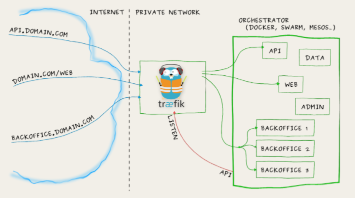
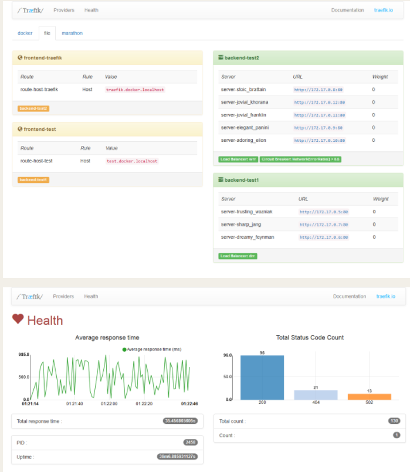
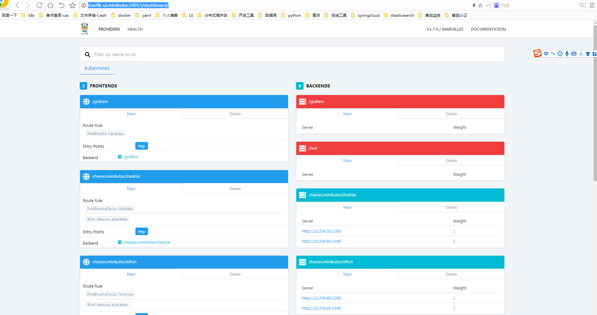

#  traefik简介
https://www.jianshu.com/p/1afe374f4333

https://blog.csdn.net/java_zyq/article/details/82496842
```
Træfɪk 是一个为了让部署微服务更加便捷而诞生的现代HTTP反向代理、负载均衡工具。 它支持多种后台 (Docker, Swarm, Kubernetes, Marathon, Mesos, Consul, Etcd, Zookeeper, BoltDB, Rest API, file…) 
来自动化、动态的应用它的配置文件设置。

```




# 特性

```

它非常快
无需安装其他依赖，通过Go语言编写的单一可执行文件
支持 Rest API
多种后台支持：Docker, Swarm, Kubernetes, Marathon, Mesos, Consul, Etcd, 并且还会更多
后台监控, 可以监听后台变化进而自动化应用新的配置文件设置
配置文件热更新。无需重启进程
正常结束http连接
后端断路器
轮询，rebalancer 负载均衡
Rest Metrics
支持最小化 官方 docker 镜像
后台支持SSL
前台支持SSL（包括SNI）
清爽的AngularJS前端页面
支持Websocket
支持HTTP/2
网络错误重试
支持Let’s Encrypt (自动更新HTTPS证书)
高可用集群模式

```

# 清爽的界面，Træfɪk 拥有一个基于AngularJS编写的简单网站界面




# 安装部署

下载https://github.com/containous/traefik/tree/v1.7

```
  cd /opt/traefik-1.7/examples/k8s
```

# 修改yaml 文件

ingress-traefik.namespace.yaml

```
kind: Namespace
apiVersion: v1
metadata:
  name: ingress-traefik
  labels:
    name: ingress-traefik
```

traefik-rbac.yaml

```
---
kind: ClusterRole
apiVersion: rbac.authorization.k8s.io/v1beta1
metadata:
  name: traefik-ingress-controller
rules:
  - apiGroups:
      - ""
    resources:
      - services
      - endpoints
      - secrets
    verbs:
      - get
      - list
      - watch
  - apiGroups:
      - extensions
    resources:
      - ingresses
    verbs:
      - get
      - list
      - watch
  - apiGroups:
    - extensions
    resources:
    - ingresses/status
    verbs:
    - update
---
kind: ClusterRoleBinding
apiVersion: rbac.authorization.k8s.io/v1beta1
metadata:
  name: traefik-ingress-controller
roleRef:
  apiGroup: rbac.authorization.k8s.io
  kind: ClusterRole
  name: traefik-ingress-controller
subjects:
- kind: ServiceAccount
  name: traefik-ingress-controller
  namespace: ingress-traefik
  
```

traefik-ds.yaml
```

---
apiVersion: v1
kind: ServiceAccount
metadata:
  name: traefik-ingress-controller
  namespace: ingress-traefik
---
kind: DaemonSet
apiVersion: extensions/v1beta1
metadata:
  name: traefik-ingress-controller
  namespace: ingress-traefik
  labels:
    k8s-app: traefik-ingress-lb
spec:
  template:
    metadata:
      labels:
        k8s-app: traefik-ingress-lb
        name: traefik-ingress-lb
    spec:
      serviceAccountName: traefik-ingress-controller
      terminationGracePeriodSeconds: 60
      containers:
      - image: traefik:1.7
        name: traefik-ingress-lb
        ports:
        - name: http
          containerPort: 80
        - name: admin
          containerPort: 8080
        securityContext:
          capabilities:
            drop:
            - ALL
            add:
            - NET_BIND_SERVICE
        args:
        - --api
        - --kubernetes
        - --logLevel=INFO
---
kind: Service
apiVersion: v1
metadata:
  name: traefik-ingress-service
  namespace: ingress-traefik
spec:
  selector:
    k8s-app: traefik-ingress-lb
  type: NodePort
  ports:
    - protocol: TCP
      port: 80
      name: web
    - protocol: TCP
      port: 8080
      name: admin
```

cheese-deployments.yaml

```
---
kind: Deployment
apiVersion: extensions/v1beta1
metadata:
  name: stilton
  namespace: ingress-traefik
  labels:
    app: cheese
    cheese: stilton
spec:
  replicas: 2
  selector:
    matchLabels:
      app: cheese
      task: stilton
  template:
    metadata:
      labels:
        app: cheese
        task: stilton
        version: v0.0.1
    spec:
      containers:
      - name: cheese
        image: errm/cheese:stilton
        resources:
          requests:
            cpu: 100m
            memory: 50Mi
          limits:
            cpu: 100m
            memory: 50Mi
        ports:
        - containerPort: 80
---
kind: Deployment
apiVersion: extensions/v1beta1
metadata:
  name: cheddar
  namespace: ingress-traefik
  labels:
    app: cheese
    cheese: cheddar
spec:
  replicas: 2
  selector:
    matchLabels:
      app: cheese
      task: cheddar
  template:
    metadata:
      labels:
        app: cheese
        task: cheddar
        version: v0.0.1
    spec:
      containers:
      - name: cheese
        image: errm/cheese:cheddar
        resources:
          requests:
            cpu: 100m
            memory: 50Mi
          limits:
            cpu: 100m
            memory: 50Mi
        ports:
        - containerPort: 80
---
kind: Deployment
apiVersion: extensions/v1beta1
metadata:
  name: wensleydale
  namespace: ingress-traefik
  labels:
    app: cheese
    cheese: wensleydale
spec:
  replicas: 2
  selector:
    matchLabels:
      app: cheese
      task: wensleydale
  template:
    metadata:
      labels:
        app: cheese
        task: wensleydale
        version: v0.0.1
    spec:
      containers:
      - name: cheese
        image: errm/cheese:wensleydale
        resources:
          requests:
            cpu: 100m
            memory: 50Mi
          limits:
            cpu: 100m
            memory: 50Mi
        ports:
        - containerPort: 80
```
cheese-services.yaml

```
---
apiVersion: v1
kind: Service
metadata:
  name: stilton
  namespace: ingress-traefik
spec:
  ports:
  - name: http
    targetPort: 80
    port: 80
  selector:
    app: cheese
    task: stilton
---
apiVersion: v1
kind: Service
metadata:
  name: cheddar
  namespace: ingress-traefik
spec:
  ports:
  - name: http
    targetPort: 80
    port: 80
  selector:
    app: cheese
    task: cheddar
---
apiVersion: v1
kind: Service
metadata:
  name: wensleydale
  namespace: ingress-traefik
spec:
  ports:
  - name: http
    targetPort: 80
    port: 80
  selector:
    app: cheese
    task: wensleydale
```

ui.yaml

```
---
apiVersion: v1
kind: Service
metadata:
  name: traefik-web-ui
  namespace: ingress-traefik
spec:
  selector:
    k8s-app: traefik-ingress-lb
  ports:
  - name: web
    port: 80
    targetPort: 8080
---
apiVersion: extensions/v1beta1
kind: Ingress
metadata:
  name: traefik-web-ui
  namespace: ingress-traefik
spec:
  rules:
  - host: traefik-ui.minikube
    http:
      paths:
      - path: /
        backend:
          serviceName: traefik-web-ui
          servicePort: web
```

cheese-default-ingress.yaml

```
apiVersion: extensions/v1beta1
kind: Ingress
metadata:
  name: cheese-default
  namespace: ingress-traefik
spec:
  backend:
    serviceName: stilton
    servicePort: 80
```


cheeses-ingress.yaml

```
apiVersion: extensions/v1beta1
kind: Ingress
metadata:
  name: cheeses
  namespace: ingress-traefik
  annotations:
    traefik.frontend.rule.type: PathPrefixStrip
spec:
  rules:
  - host: cheeses.minikube
    http:
      paths:
      - path: /stilton
        backend:
          serviceName: stilton
          servicePort: http
      - path: /cheddar
        backend:
          serviceName: cheddar
          servicePort: http
      - path: /wensleydale
        backend:
          serviceName: wensleydale
          servicePort: http
```


# 执行yaml

```
kubectl apply -f .
```

# 查看效果
kubectl -n ingress-traefik get pod,svc,ingress -o wide
```
NAME                                   READY   STATUS    RESTARTS   AGE     IP             NODE            NOMINATED NODE   READINESS GATES
pod/cheddar-5cc7854cbd-m7mkf           1/1     Running   0          5h6m    10.254.28.11   192.168.1.170   <none>           <none>
pod/cheddar-5cc7854cbd-p9r7h           1/1     Running   0          5h6m    10.254.98.13   192.168.1.160   <none>           <none>
pod/stilton-5948f8564d-877rh           1/1     Running   0          5h6m    10.254.98.12   192.168.1.160   <none>           <none>
pod/stilton-5948f8564d-999g8           1/1     Running   0          5h6m    10.254.28.10   192.168.1.170   <none>           <none>
pod/traefik-ingress-controller-dmfqg   1/1     Running   0          4h17m   10.254.98.15   192.168.1.160   <none>           <none>
pod/traefik-ingress-controller-k6q6x   1/1     Running   0          4h17m   10.254.28.13   192.168.1.170   <none>           <none>
pod/wensleydale-d89d5d5f6-68bnr        1/1     Running   0          5h6m    10.254.98.14   192.168.1.160   <none>           <none>
pod/wensleydale-d89d5d5f6-r2wz4        1/1     Running   0          5h6m    10.254.28.12   192.168.1.170   <none>           <none>

NAME                              TYPE        CLUSTER-IP       EXTERNAL-IP   PORT(S)                       AGE     SELECTOR
service/cheddar                   ClusterIP   10.254.83.16     <none>        80/TCP                        5h6m    app=cheese,task=cheddar
service/stilton                   ClusterIP   10.254.188.156   <none>        80/TCP                        5h6m    app=cheese,task=stilton
service/traefik-ingress-service   NodePort    10.254.28.110    <none>        80:22680/TCP,8080:34915/TCP   4h17m   k8s-app=traefik-ingress-lb
service/wensleydale               ClusterIP   10.254.128.110   <none>        80/TCP                        5h6m    app=cheese,task=wensleydale

NAME                                HOSTS                 ADDRESS   PORTS   AGE
ingress.extensions/cheese-default   *                               80      5h6m
ingress.extensions/cheeses          cheeses.minikube                80      5h5m
ingress.extensions/traefik-web-ui   traefik-ui.minikube             80      5h6m

```

# 访问服务（要配置hosts，和开启防火墙端口）

http://cheeses.minikube:22680/stilton

http://cheeses.minikube:22680/stilton

http://cheeses.minikube:22680/stilton

http://traefik-ui.minikube:34915/dashboard/




