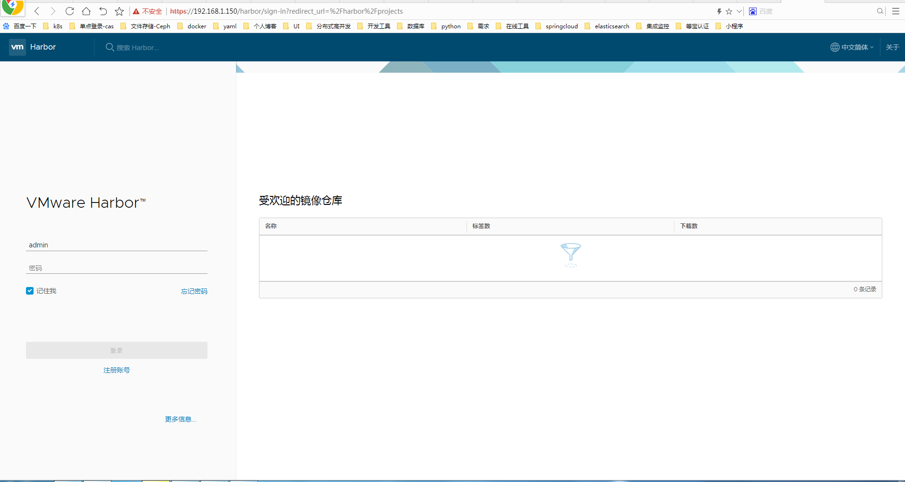

# 部署 harbor 私有仓库

## 下载文件

从 docker compose 发布页面下载最新的 docker-compose 二进制文件

```
  $ wget https://github.com/docker/compose/releases/download/1.21.2/docker-compose-Linux-x86_64
  $ mv ~/docker-compose-Linux-x86_64 /k8s/kubernetes/bin/docker-compose
  $ chmod a+x  /opt/k8s/bin/docker-compose
  $ export PATH=/opt/k8s/bin:$PATH
  
   curl -L https://github.com/docker/compose/releases/download/1.8.1/docker-compose-`uname -s`-`uname -m` > /usr/local/bin/docker-compose
```


从 harbor 发布页面下载最新的 harbor 离线安装包

```
wget http://harbor.orientsoft.cn/harbor-v1.5.0/harbor-offline-installer-v1.5.0.tgz
tar -xzvf harbor-offline-installer-v1.5.1.tgz

```

## 导入 docker images

导入离线安装包中 harbor 相关的 docker images：

```
docker load -i harbor.v1.5.0.tar.gz
```

## 创建 harbor nginx 服务器使用的 x509 证书

创建 harbor 证书签名请求：

```
$ cat > harbor-csr.json <<EOF
{
  "CN": "harbor",
  "hosts": [
    "127.0.0.1",
    "192.168.1.150"
  ],
  "key": {
    "algo": "rsa",
    "size": 2048
  },
  "names": [
    {
      "C": "CN",
      "ST": "Shenzhen",
      "L": "Shenzhen",
      "O": "k8s",
      "OU": "4Paradigm"
    }
  ]
}
EOF
```

hosts 字段指定授权使用该证书的当前部署节点 IP，如果后续使用域名访问 harbor 则还需要添加域名；

生成 harbor 证书和私钥：

01 初始化环境.md 中创建kubernetes 使用ca-config.json和ca-csr.json,并执行


``` 
   cfssl gencert -initca ca-csr.json | cfssljson -bare ca -
   cfssl gencert -ca=/k8s/kubernetes/ssl/ca.pem -ca-key=/k8s/kubernetes/ssl/ca-key.pem -config=/opt/harbor/ssl/ca-config.json -profile=kubernetes harbor-csr.json | cfssljson -bare harbor
```

修改 harbor.cfg 文件

```
## Configuration file of Harbor

#This attribute is for migrator to detect the version of the .cfg file, DO NOT MODIFY!
_version = 1.5.0
#The IP address or hostname to access admin UI and registry service.
#DO NOT use localhost or 127.0.0.1, because Harbor needs to be accessed by external clients.
hostname = 192.168.1.150   #需要修改主机名或Ip

#The protocol for accessing the UI and token/notification service, by default it is http.
#It can be set to https if ssl is enabled on nginx.
ui_url_protocol = https   #修改协议为https

#Maximum number of job workers in job service  
max_job_workers = 50 

#Determine whether or not to generate certificate for the registry's token.
#If the value is on, the prepare script creates new root cert and private key 
#for generating token to access the registry. If the value is off the default key/cert will be used.
#This flag also controls the creation of the notary signer's cert.
customize_crt = on

#The path of cert and key files for nginx, they are applied only the protocol is set to https
ssl_cert = /opt/harbor/ssl/harbor.pem      #修改自签名证书
ssl_cert_key = /opt/harbor/ssl/harbor-key.pem  #修改自签名证书

#The path of secretkey storage
secretkey_path = /data   #自己创建目录

#Admiral's url, comment this attribute, or set its value to NA when Harbor is standalone
admiral_url = NA

#Log files are rotated log_rotate_count times before being removed. If count is 0, old versions are removed rather than rotated.
log_rotate_count = 50
#Log files are rotated only if they grow bigger than log_rotate_size bytes. If size is followed by k, the size is assumed to be in kilobytes. 
#If the M is used, the size is in megabytes, and if G is used, the size is in gigabytes. So size 100, size 100k, size 100M and size 100G 
#are all valid.
log_rotate_size = 200M

#Config http proxy for Clair, e.g. http://my.proxy.com:3128
#Clair doesn't need to connect to harbor ui container via http proxy.
http_proxy =
https_proxy =
no_proxy = 127.0.0.1,localhost,ui

#NOTES: The properties between BEGIN INITIAL PROPERTIES and END INITIAL PROPERTIES
#only take effect in the first boot, the subsequent changes of these properties 
#should be performed on web ui

#************************BEGIN INITIAL PROPERTIES************************

#Email account settings for sending out password resetting emails.

#Email server uses the given username and password to authenticate on TLS connections to host and act as identity.
#Identity left blank to act as username.
email_identity = 

email_server = smtp.mydomain.com
email_server_port = 25
email_username = sample_admin@mydomain.com
email_password = abc
email_from = admin <sample_admin@mydomain.com>
email_ssl = false
email_insecure = false

##The initial password of Harbor admin, only works for the first time when Harbor starts. 
#It has no effect after the first launch of Harbor.
#Change the admin password from UI after launching Harbor.
harbor_admin_password = kys123456   #修改admin登录密码

##By default the auth mode is db_auth, i.e. the credentials are stored in a local database.
#Set it to ldap_auth if you want to verify a user's credentials against an LDAP server.
auth_mode = db_auth

#The url for an ldap endpoint.
ldap_url = ldaps://ldap.mydomain.com

#A user's DN who has the permission to search the LDAP/AD server. 
#If your LDAP/AD server does not support anonymous search, you should configure this DN and ldap_search_pwd.
#ldap_searchdn = uid=searchuser,ou=people,dc=mydomain,dc=com

#the password of the ldap_searchdn
#ldap_search_pwd = password

#The base DN from which to look up a user in LDAP/AD
ldap_basedn = ou=people,dc=mydomain,dc=com

#Search filter for LDAP/AD, make sure the syntax of the filter is correct.
#ldap_filter = (objectClass=person)

# The attribute used in a search to match a user, it could be uid, cn, email, sAMAccountName or other attributes depending on your LDAP/AD  
ldap_uid = uid 

#the scope to search for users, 0-LDAP_SCOPE_BASE, 1-LDAP_SCOPE_ONELEVEL, 2-LDAP_SCOPE_SUBTREE
ldap_scope = 2 

#Timeout (in seconds)  when connecting to an LDAP Server. The default value (and most reasonable) is 5 seconds.
ldap_timeout = 5

#Verify certificate from LDAP server
ldap_verify_cert = true

#The base dn from which to lookup a group in LDAP/AD
ldap_group_basedn = ou=group,dc=mydomain,dc=com

#filter to search LDAP/AD group
ldap_group_filter = objectclass=group

#The attribute used to name a LDAP/AD group, it could be cn, name
ldap_group_gid = cn

#The scope to search for ldap groups. 0-LDAP_SCOPE_BASE, 1-LDAP_SCOPE_ONELEVEL, 2-LDAP_SCOPE_SUBTREE
ldap_group_scope = 2

#Turn on or off the self-registration feature
self_registration = on

#The expiration time (in minute) of token created by token service, default is 30 minutes
token_expiration = 30

#The flag to control what users have permission to create projects
#The default value "everyone" allows everyone to creates a project. 
#Set to "adminonly" so that only admin user can create project.
project_creation_restriction = everyone

#************************END INITIAL PROPERTIES************************

#######Harbor DB configuration section#######

#The address of the Harbor database. Only need to change when using external db.
db_host = mysql

#The password for the root user of Harbor DB. Change this before any production use.
db_password = root123

#The port of Harbor database host
db_port = 3306

#The user name of Harbor database
db_user = root

##### End of Harbor DB configuration#######

#The redis server address. Only needed in HA installation.
#address:port[,weight,password,db_index]
redis_url = redis:6379

##########Clair DB configuration############

#Clair DB host address. Only change it when using an exteral DB.
clair_db_host = postgres

#The password of the Clair's postgres database. Only effective when Harbor is deployed with Clair.
#Please update it before deployment. Subsequent update will cause Clair's API server and Harbor unable to access Clair's database.
clair_db_password = password

#Clair DB connect port
clair_db_port = 5432

#Clair DB username
clair_db_username = postgres

#Clair default database
clair_db = postgres

##########End of Clair DB configuration############

#The following attributes only need to be set when auth mode is uaa_auth
uaa_endpoint = uaa.mydomain.org
uaa_clientid = id
uaa_clientsecret = secret
uaa_verify_cert = true
uaa_ca_cert = /path/to/ca.pem


### Docker Registry setting ###
#registry_storage_provider can be: filesystem, s3, gcs, azure, etc.
registry_storage_provider_name = filesystem
#registry_storage_provider_config is a comma separated "key: value" pairs, e.g. "key1: value, key2: value2".
#Refer to https://docs.docker.com/registry/configuration/#storage for all available configuration.
registry_storage_provider_config =

```

##  加载和启动 harbor 镜像

 ```
$ sudo mkdir /data
$ sudo chmod 777 /var/run/docker.sock /data
$ sudo apt-get install python
$ ./install.sh
 ```
 
 ## 检查启动
 
 ```
 docker-compose ps
        Name                     Command               State                                Ports                               
------------------------------------------------------------------------------------------------------------------------------
harbor-adminserver   /harbor/start.sh                 Up                                                                       
harbor-db            /usr/local/bin/docker-entr ...   Up      3306/tcp                                                         
harbor-jobservice    /harbor/start.sh                 Up                                                                       
harbor-log           /bin/sh -c /usr/local/bin/ ...   Up      127.0.0.1:1514->10514/tcp                                        
harbor-ui            /harbor/start.sh                 Up                                                                       
nginx                nginx -g daemon off;             Up      0.0.0.0:443->443/tcp, 0.0.0.0:4443->4443/tcp, 0.0.0.0:80->80/tcp 
redis                docker-entrypoint.sh redis ...   Up      6379/tcp                                                         
registry             /entrypoint.sh serve /etc/ ...   Up      5000/tcp                                                         
 ```
 
 检查日志
 
 ```
  cd /var/log/harbor
  
-rw-r----- 1 10000 10000  661853 Mar 29 10:30 adminserver.log
-rw-r----- 1 10000 10000   31783 Mar 29 09:52 jobservice.log
-rw-r----- 1 10000 10000   72276 Mar 29 10:03 mysql.log
-rw-r----- 1 10000 10000  368126 Mar 29 10:30 proxy.log
-rw-r----- 1 10000 10000  175597 Mar 29 10:27 redis.log
-rw-r----- 1 10000 10000  805840 Mar 29 10:30 registry.log
-rw-r----- 1 10000 10000 6668946 Mar 29 10:30 ui.log
 ```
 ## 登录harbor
 
 https://192.168.1.160/harbor/projects
 admin/kys123456
 
 
 
 ## 命令行登录
 
 ```
     vim /etc/docker/daemon.json
     {
        "registry-mirrors": ["https://xxx.mirror.aliyuncs.com"],
        "insecure-registries": ["192.168.1.173"]
     }
     systemctl daemon-reload
     systemctl restart docker

    docker login 192.168.1.160
    
    Username: admin
    Password: 
    WARNING! Your password will be stored unencrypted in /root/.docker/config.json.
    Configure a credential helper to remove this warning. See
    https://docs.docker.com/engine/reference/commandline/login/#credentials-store

    Login Succeeded
    
    docker tag centos-zh 192.168.1.160/test/centos-zh:v1
    docker push  192.168.1.160/test/centos-zh:v1
    
 ```
 
 
 

