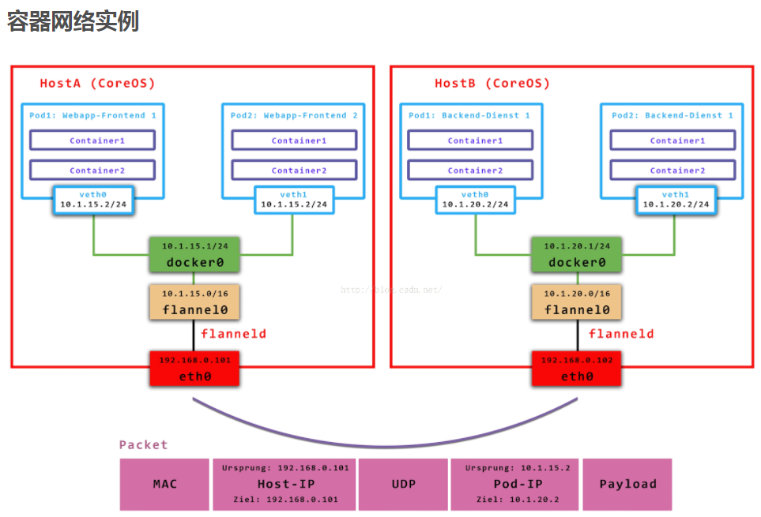

服务中的3个端口设置
这几个port的概念很容易混淆，比如创建如下service：

apiVersion: v1
kind: Service
metadata:
  labels:
    name: app1
  name: app1
  namespace: default
spec:
  type: NodePort
  ports:
  - <strong>port: 8080
    targetPort: 8080
    nodePort: 30062</strong>
  selector:
    name: app1

port
The port that the service is exposed on the service’s cluster ip (virsual ip). Port is the service port which is accessed by others with cluster ip.

即，这里的port表示：service暴露在cluster ip上的端口，<cluster ip>:port 是提供给集群内部客户访问service的入口。

nodePort
On top of having a cluster-internal IP, expose the service on a port on each node of the cluster (the same port on each node). You'll be able to contact the service on any<nodeIP>:nodePortaddress. So nodePort is alse the service port which can be accessed by the node ip by others with external ip.

首先，nodePort是kubernetes提供给集群外部客户访问service入口的一种方式（另一种方式是LoadBalancer），所以，<nodeIP>:nodePort 是提供给集群外部客户访问service的入口。

targetPort
The port on the pod that the service should proxy traffic to.

targetPort很好理解，targetPort是pod上的端口，从port和nodePort上到来的数据最终经过kube-proxy流入到后端pod的targetPort上进入容器。

port、nodePort总结
总的来说，port和nodePort都是service的端口，前者暴露给集群内客户访问服务，后者暴露给集群外客户访问服务。从这两个端口到来的数据都需要经过反向代理kube-proxy流入后端pod的targetPod，从而到达pod上的容器内。

When a client connects to the VIP the iptables rule kicks in, and redirects the packets to the serviceproxy's own port (random port). The service proxy chooses a backend, and starts proxying traffic from the client to the backend. This means that service owers can choose any port they want without risk of collision.The same basic flow executes when traffic comes in through a nodePort or through a LoadBalancer, though in those cases the client IP does get altered.
--------------------- 
作者：xinghun_4 
来源：CSDN 
原文：https://blog.csdn.net/xinghun_4/article/details/50492041 
版权声明：本文为博主原创文章，转载请附上博文链接！
